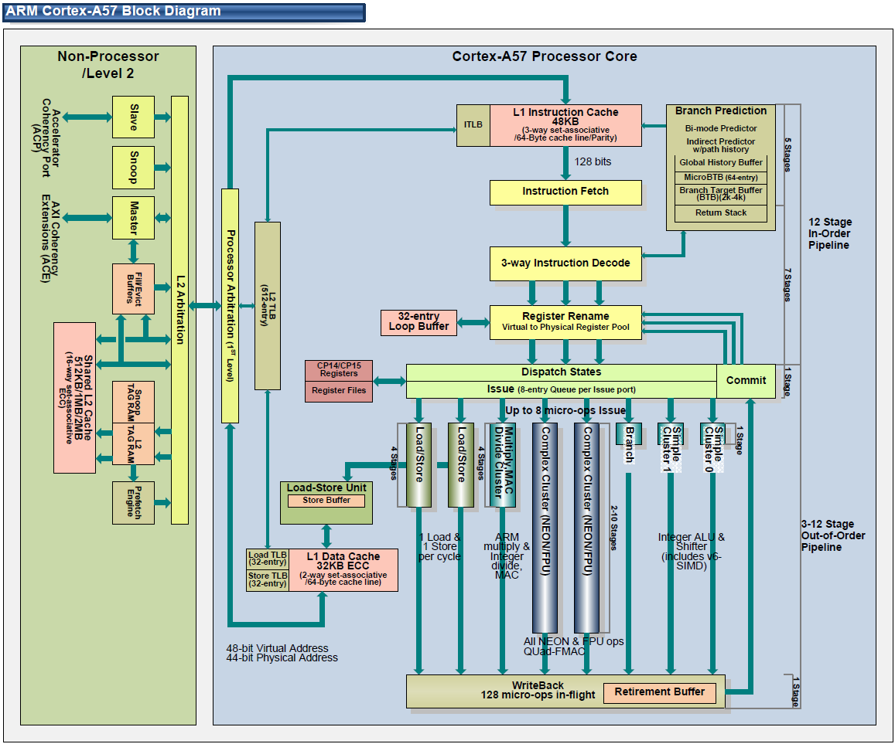
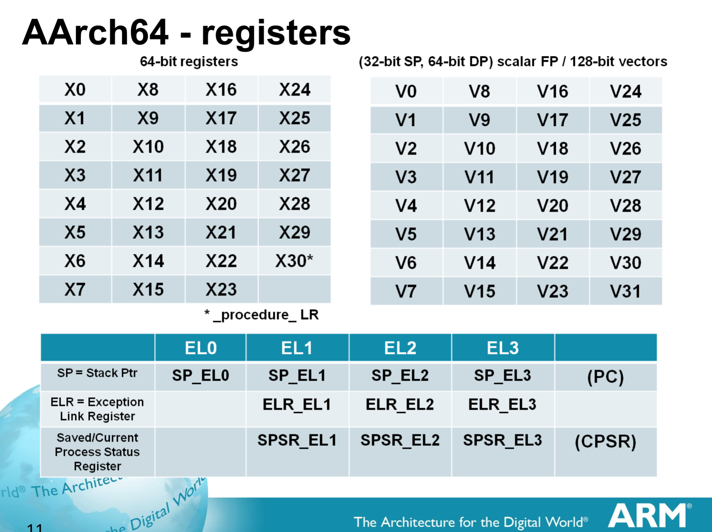

=======================
Processor Architecture
=======================

Specs
======
The Raspberry Pi 3 uses an ARM Cortex A53 processor, utilizing the ARMv8-A 64-bit instruction set It comes with 4 cores running at  1.2 GHz. While it uses a 64-bit instruction set, it is also capable of seamlessly supporting 32-bit instruction sets to allow for backwards compatibility.

Block Diagram
==============

(Note: this block diagram is of the Cortex-A57 processor, which is the more powerful version of the A53)

Processor Operation
====================
* Instructions are fetched from the L1 Instruction Cache
* Up to 3 instructions can then be decoded at a time (3-way instruction decode)
* Registers are renamed to avoid any problems in data dependencies between instructions
* Up to 8 micro-operations can then be performed simultaneously
* Data is then retired either to registers or L1 Data Cache

Registers
==========

* ARMv8 uses 31 64-bit general purpose registers, referred to X0 through X30. They can also be used in a 32-bit form by referring to them as W0 through W30, which disregards the upper 32-bits of the register. Writing to a register using the W naming convention zeroes out the upper 32-bits.
* Additionally, there are 32 128-bit floating point registers, referred to as V0 through V31. The precision of these registers can be changed to Double (64-bits), Single (32-bits), and Half (16-bits) using Dn, Sn, and Hn to refer to the registers, respectively. 
 

